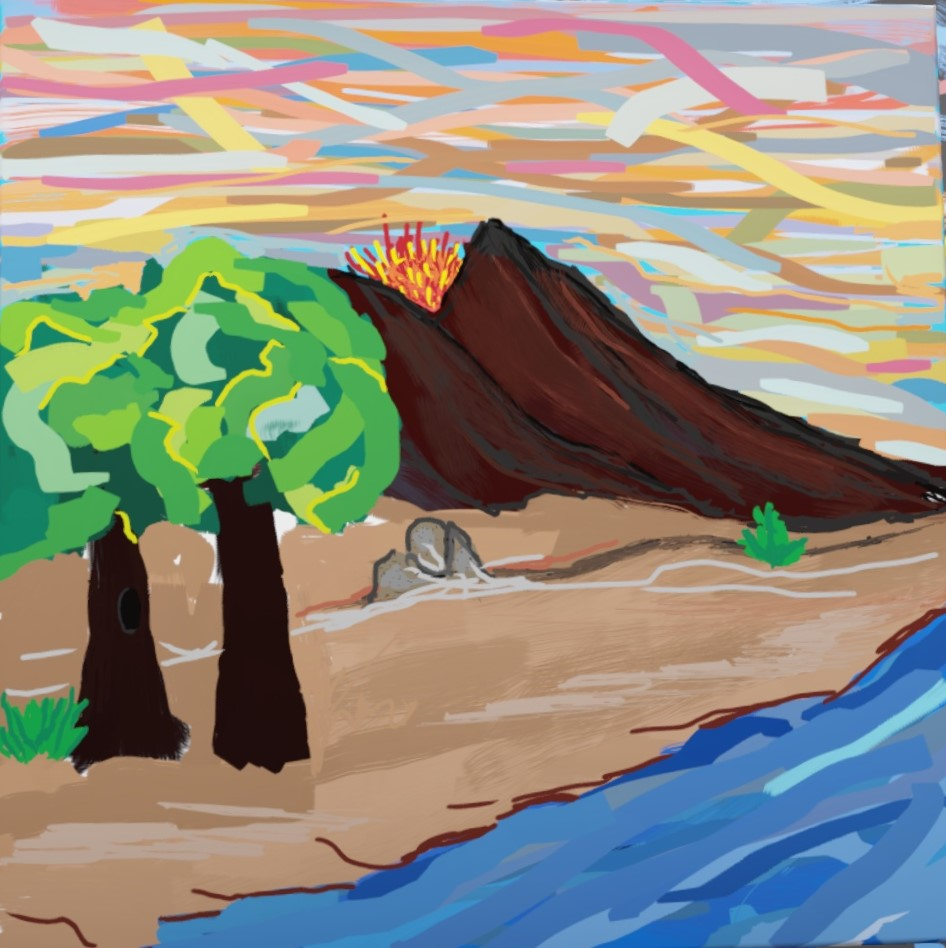
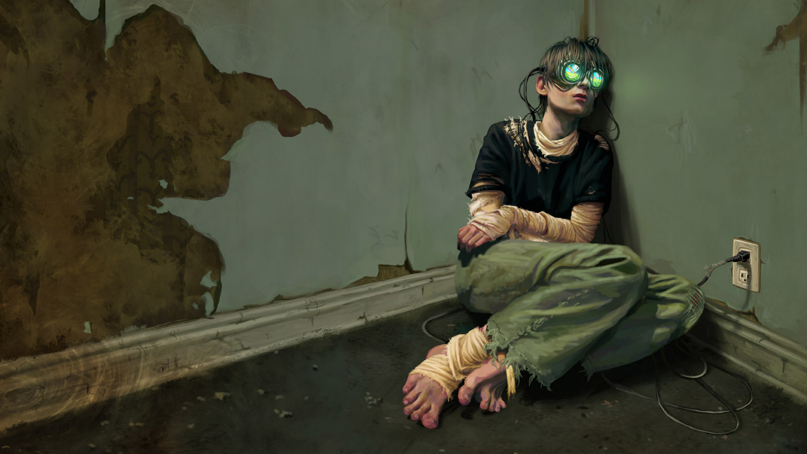
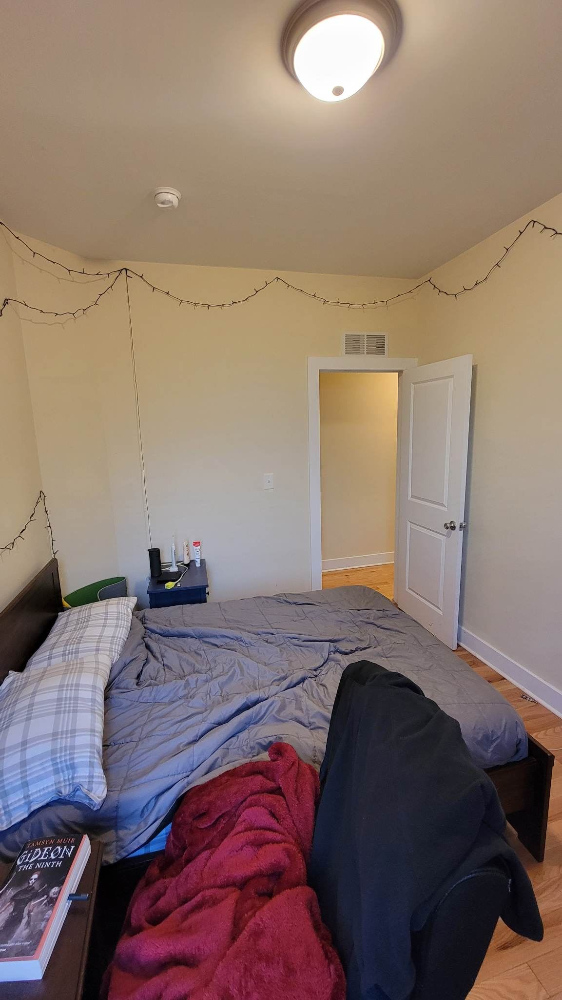
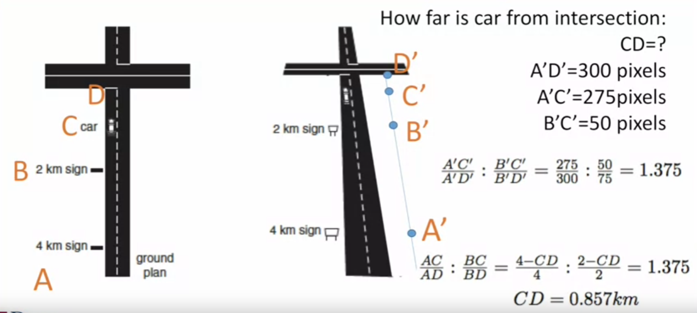
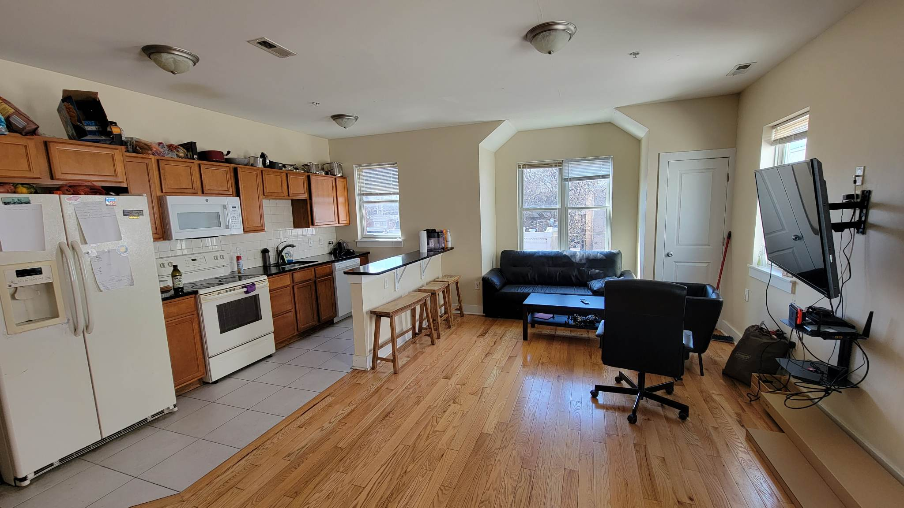
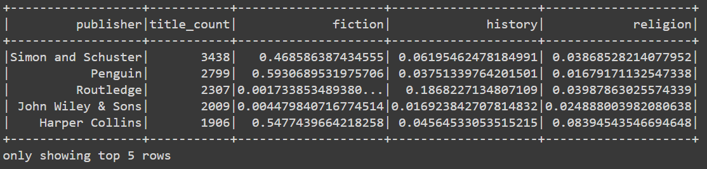

## Test conducted on ./images/meal.png (Resolution: 2048x1365)


### Text Query: "Write a short, engaging blog post based on this picture. It should include a description of the meal in the photo and talk about my journey meal prepping."

### Google Gemini Pro Vision Response:
 Meal prepping is a great way to save time and money, and it can also help you to eat healthier. This meal is a great example of a healthy and delicious meal that can be easily prepped ahead of time.

This meal features brown rice, roasted vegetables, and chicken teriyaki. The brown rice is a whole grain that is high in fiber and nutrients. The roasted vegetables are a great way to get your daily dose of vitamins and minerals. And the chicken teriyaki is a lean protein source that is also packed with flavor.

This meal is easy to prepare ahead of time. Simply cook the brown rice, roast the vegetables, and cook the chicken teriyaki. Then, divide the meal into individual containers and store them in the refrigerator. When you're ready to eat, simply grab a container and reheat it in the microwave.

This meal is a great option for busy people who are looking for a healthy and delicious way to eat. It's also a great way to save money on food. By prepping your meals ahead of time, you can avoid the temptation to eat out or order takeout.

If you're new to meal prepping, I encourage you to give it a try. It's a great way to improve your health and save money. And with so many delicious recipes available, you're sure to find something you love.

**Time Taken:** 11.73 seconds

### CogVLM Response:
The photo showcases a meal prepped in two transparent containers. The meal consists of rice, chunks of what appears to be chicken or tofu, and a variety of colorful vegetables including broccoli, carrots, and red bell peppers. The vegetables are sliced into thin strips, and the chicken or tofu pieces are coated in a sauce. The containers are placed on a gray surface, and there are some sesame seeds scattered around. Additionally, there's a small bowl of white sesame seeds next to the containers. The meal is neatly arranged, and the colors are vibrant, making it visually appealing.
Meal prepping is a great way to ensure that you have healthy and nutritious meals ready to go, especially when you're busy with work or other commitments. It's also a great way to save time and money, as you can prepare a week's worth of meals in one go. By meal prepping, you can ensure that you're eating healthy and balanced meals, which is essential for maintaining a healthy lifestyle.

**Time Taken:** 27.52 seconds

## Test conducted on ./images/silly_painting.jpg (Resolution: 946x948)



### Text Query: "Whats peculiar about this painting? Can you describe it?"

### Google Gemini Pro Vision Response:
 It looks like the sky is on fire with bright red, orange, yellow, and pink colors. There is a volcano erupting with lava flowing down its side. There are two trees that are not affected by the volcano. There is a river in the foreground. The painting has a childlike quality to it, with simple shapes and bright colors.

**Time Taken:** 4.45 seconds

### CogVLM Response:
The painting is peculiar because it depicts a scene that seems to be a mix of natural and abstract elements. There is a mountain with a bright orange flame at its peak, two trees with green leaves, a gray rock, and a blue river. However, the sky is filled with colorful, swirling patterns that do not resemble traditional clouds or atmospheric phenomena.

**Time Taken:** 9.48 seconds

## Test conducted on ./images/abstract.jpg (Resolution: 3938x2215)



### Text Query: "What is the abstract meaning you infer from this image? Write a creative poem about it."

### Google Gemini Pro Vision Response:
 In the depths of a forgotten room,
A boy sits alone, his eyes aglow.
Goggles of emerald, a window to the unseen,
In the darkness, he finds solace.

Through the lenses, he perceives a world transformed,
Fractured and distorted, yet strangely beautiful.
Reality unravels, revealing secrets untold,
As he gazes upon the world with eyes anew.

The room becomes a canvas of possibility,
Where walls melt and dreams take flight.
With each blink, a new universe is born,
And the boy's imagination knows no bounds.

Yet beneath the surface, a yearning persists,
A longing for connection, for a hand to hold.
For in this realm of infinite wonder,
Loneliness lingers, a constant companion.

The boy reaches out, his fingers tracing the air,
Searching for something to grasp onto.
But the world slips through his grasp,
Leaving him adrift in a sea of fractured realities.

And so he sits, suspended between worlds,
Eyes glowing with the light of a thousand possibilities,
Yet yearning for a glimpse of true connection.
In the abstract realm of his solitary confinement,
The boy dreams of a bridge, a way to span the divide,
To find his place in a world that remains elusive.

**Time Taken:** 8.31 seconds

### CogVLM Response:
This image is a painting,
A girl sitting alone in a corner,
Wearing a black shirt and green pants,
Her eyes are covered by a pair of goggles,
Her hands are bound by ropes,
Her feet are bare,
Her expression is indifferent,
As if she has forgotten the world.

The background is a dilapidated room,
The walls are peeling,
The floor is stained with dirt,
The atmosphere is gloomy and desolate.

The girl seems to be trapped in this room,
Like a prisoner,
She has no freedom,
No hope,
No future.

But her eyes are full of determination,
She is not afraid of loneliness,
Because she believes that there is a light at the end of the tunnel,
She believes that she will eventually escape from this darkness.

This painting is a reflection of reality,
It shows the pain and struggle of people,
But it also shows the courage and hope of people,
It inspires us to move forward bravely.

**Time Taken:** 38.58 seconds

## Test conducted on ./images/bedroom.jpg (Resolution: 1153x2048)



### Text Query: "I'm feeling bored. I think this would be a great time to get productive work done. What do you think about my room? How can I better decorate and organize it? I want it to look more alive!"

### Google Gemini Pro Vision Response:
 Here are some ideas to make your room more lively:
- Add some plants. Plants can add life and color to any room, and they can also help to improve air quality.
- Hang some artwork. Artwork can add personality and interest to your room, and it can also help to tie the space together.
- Get a new comforter or duvet cover. A new comforter or duvet cover can give your room a fresh look, and it can also help to make it more cozy.
- Add some pillows. Pillows can add comfort and style to your bed, and they can also help to make it look more inviting.
- Rearrange your furniture. Rearranging your furniture can help to give your room a new look, and it can also help to make it more functional.
- Add some storage. If you're feeling cramped, adding some storage can help to free up space and make your room look more organized.
- Get a new rug. A new rug can help to add warmth and texture to your room, and it can also help to define the space.
- Add some lighting. Lighting can help to set the mood in your room, and it can also help to make it more functional.

**Time Taken:** 9.31 seconds

### CogVLM Response:
This room is very simple and unadorned, but it is also very practical. You can try to add some decorations to the room, such as hanging some paintings or posters on the walls, or placing some plants. You can also try to rearrange the furniture layout to make the room look more spacious and lively. In addition, you can also consider adding some colorful items, such as rugs or curtains, to the room to add some vibrancy. Overall, the key is to make the room more personalized and comfortable.

**Time Taken:** 12.78 seconds

## Test conducted on ./images/cv_problem.PNG (Resolution: 1271x572)



### Text Query: "Can you solve this computer vision problem? Provide sufficient steps."

### Google Gemini Pro Vision Response:
 To find the distance of the car from the intersection, we can use similar triangles. We know that the distance from the car to the 2km sign (AC) is 4km, and the distance from the 2km sign to the intersection (BC) is 2km. We also know that the distance from the car to the point where the line of sight intersects the 4km sign (A'C') is 275 pixels, and the distance from the point where the line of sight intersects the 4km sign to the intersection (B'C') is 50 pixels.

We can use the following equation to find the distance from the car to the intersection (CD):

AC/BC = A'C'/B'C'

4/2 = 275/50

2 = 5.5

CD = 5.5 * 2

CD = 11km

Therefore, the car is 11km away from the intersection.

**Time Taken:** 8.61 seconds

### CogVLM Response:
Plan: To solve this computer vision problem, the following steps could be considered: First, identify the key elements and measurements required to calculate the distance between the car and the intersection. Then, use trigonometry to relate the visual angles to the actual distance. Finally, use the known distance and angles to calculate the exact position of the car in relation to the intersection.
Next Action: Click on the 'A' box to select the ground plane of the car, which is necessary for calculating the distance from the car to the intersection.

**Time Taken:** 10.58 seconds

## Test conducted on ./images/cycles.jpg (Resolution: 1600x1200)


### Text Query: "Can you identify the city in the horizon? Also, what kind of bikes are those?"

### Google Gemini Pro Vision Response:
 The city in the horizon is Wilmington, Delaware. The bikes are all road bikes.

**Time Taken:** 13.89 seconds

### CogVLM Response:
Yes, the city in the horizon appears to be a modern cityscape with tall buildings. The bikes are road bikes, typically used for cycling on paved roads.

**Time Taken:** 7.06 seconds

## Test conducted on ./images/dalle.png (Resolution: 1151x1383)


### Text Query: "What is going on in this screenshot?"

### Google Gemini Pro Vision Response:
 This is an image generated by DALL-E mini, an AI model that can generate images from text prompts. The prompt for this image was "Master Chief from Halo doing Bhangra with Freddie Mercury". The image shows Master Chief, a character from the Halo video game series, and Freddie Mercury, the lead singer of the rock band Queen, doing Bhangra, a traditional Punjabi dance.

**Time Taken:** 6.85 seconds

### CogVLM Response:
The screenshot shows a webpage with a grid of images, each depicting a crossover between the characters from the video game 'Master Chief' from Halo and the dance group 'Freddie Mercury'. The images are labeled 'DALL-E mini' indicating they are generated by an AI model. The top text reads 'DALL-E mini is an AI model that generates images from any prompt you give!' with a 'Run' button next to it. There are nine images in total, each showing a different combination of the two characters and the dance group in various poses.

**Time Taken:** 17.10 seconds

## Test conducted on ./images/handwriting.png (Resolution: 1709x1101)


### Text Query: "Can you read what's written on my note?"

### Google Gemini Pro Vision Response:
 1. First we get T0, T1, T2, T3, T4, T5, T6
2. Obtain T0, T1, T2, T3 = T0 using post multiplication
3. Initialize some config q0 = [q0, q1, q2, q3]
4. Set goal config qg
5. Set 1 obstacle for simplicity. Choose position in base frame. Say P
6. Assume distance of influence of obstacle = qo
7. Assume attractive field of strength (for each joint)
8. Assume repulsive field of strength (for each joint)
9. Assume step size for each joint
10. Initialize q = q0, i = 0

**Time Taken:** 6.63 seconds

### CogVLM Response:
Yes, the note contains a list of steps or procedures, possibly for a mathematical or scientific computation or experiment. The steps include obtaining certain matrices, setting goals, adjusting parameters, and initializing values.

**Time Taken:** 6.92 seconds

## Test conducted on ./images/home.jpg (Resolution: 2048x1153)



### Text Query: "Can you guess which country this living room is from? Also, tell me any interesting things you see that helped you make that deduction."

### Google Gemini Pro Vision Response:
 This is likely the United States.

The kitchen cabinets and appliances are all very common in American homes. The hardwood floors are also a common feature in American homes. The layout of the living room is also very typical of American homes.

**Time Taken:** 4.68 seconds

### CogVLM Response:
The living room appears to be from the United States. This deduction is based on the design of the kitchen, particularly the refrigerator, oven, and the layout of the room. Additionally, the presence of English language labels on the appliances and the overall modern design of the room further supports this conclusion.

**Time Taken:** 11.36 seconds

## Test conducted on ./images/output.png (Resolution: 1114x268)



### Text Query: "Write code that could potentially produce this output."

### Google Gemini Pro Vision Response:
 ```
library(tidyverse)

# Create a dataframe with the relevant data
df <- data.frame(
  publisher = c("Simon and Schuster", "Penguin", "Routledge", "John Wiley & Sons", "Harper Collins"),
  title_count = c(3438, 2799, 2307, 2009, 1906),
  fiction = c(0.4685863874555, 0.59306895319706, 0.00173385348938, 0.004978484077514, 0.5477439664218258),
  history = c(0.6195462478184991, 0.03751397624201501, 0.1868227134807109, 0.06192384270781483, 0.045645335512515),
  religion = c(0.03868528214077952, 0.01679173525574338, 0.80398786305257439, 0.02488003982806368, 0.0839454669464846]
)

# Round the values to 5 decimal places
df <- df %>%
  mutate(across(everything(), ~ round(.x, 5)))

# Print the dataframe
print(df)
```

**Time Taken:** 9.49 seconds

### CogVLM Response:
To produce this output, you could use a programming language like Python with a library like pandas. First, you would create a DataFrame with the columns 'publisher', 'title', 'count', 'fiction', 'history', and 'religion'. Then, you could use the 'groupby' function to group the data by the 'publisher' column and apply the 'count' function to each group to get the number of rows for each publisher.

**Time Taken:** 8.82 seconds

## Test conducted on ./images/painting.jpg (Resolution: 728x757)


### Text Query: "Is this a famous painting? Is it geometrically accurate?"

### Google Gemini Pro Vision Response:
 The painting is called "Triple Self-Portrait" by Norman Rockwell. It is not geometrically accurate. The mirror is not reflecting the girl's image correctly.

**Time Taken:** 3.85 seconds

### CogVLM Response:
Yes, this painting is a famous work by Norman Rockwell. It is a classic painting that depicts a young girl sitting in front of a mirror, deep in thought. The painting is very accurate in terms of geometry, capturing the reflection of the girl in the mirror and the details of the room.

**Time Taken:** 7.73 seconds

## Test conducted on ./images/small.png (Resolution: 32x32)


### Text Query: "What is the text here? What could this image be used as? Do you know the size of this image in pixels?"

### Google Gemini Pro Vision Response:
 The text in the image is "WF". The image could be used as a logo or as a thumbnail for a video. The size of the image is 256x256 pixels.

**Time Taken:** 3.77 seconds

### CogVLM Response:
The text in this image is "WF", which could be used as a logo or abbreviation for a company or brand. The size of this image is 128x128 pixels.

**Time Taken:** 4.08 seconds

## Test conducted on ./images/street.JPG (Resolution: 5472x3648)


### Text Query: "I am looking to find a house to rent in this neighborhood. What do you suggest I do now?"

### Google Gemini Pro Vision Response:
 I would suggest that you contact the number on the sign.

**Time Taken:** 7.49 seconds

### CogVLM Response:
First, you need to find a real estate agency or a website that provides rental information. Then, you can search for available houses by specifying the location and budget. After finding a suitable house, you can contact the owner or real estate agent to inquire about the details and rental process.

**Time Taken:** 35.71 seconds

## Test conducted on ./images/underwater.JPG (Resolution: 2560x1440)


### Text Query: "How long will she survive in this position?"

### Google Gemini Pro Vision Response:
 The woman in the picture is not in a position where she can breathe. She is underwater and her eyes are closed. It is not possible for her to survive in this position for more than a few minutes.

**Time Taken:** 5.35 seconds

### CogVLM Response:
According to the picture, it is impossible to determine how long the girl will survive in this position. However, it can be seen that she is currently submerged in water and is not breathing. If she does not receive prompt rescue and treatment, she may run out of oxygen and drown.

**Time Taken:** 15.17 seconds

